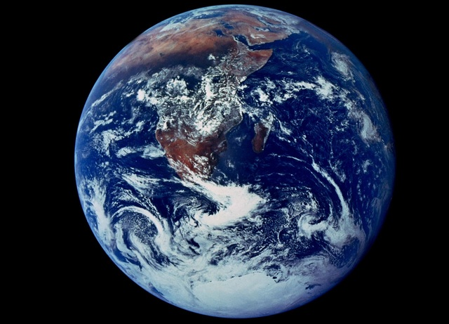

# A simple wrapper of the llama.cpp server in Python

## Installation
First, clone this repository into a folder llama-server.
This package can be installed by running `pip install --editable .` inside that folder.
The LlamaServer class provided by this package requires the "server" executable binary from [llama.cpp](https://github/com/ggerganov/Llama.cpp).
A bash script *install-llama.sh* is provided to help build the binary with CUDA support.

## Usage

Currently, the multimodal inference can be performed with the [LLaVa](https://llava-vl.github.io/) model.

### Create a llama server
```python
from llama_server import LlamaServer

config = {
    "alias": "LLaVA 1.5",
    "model": "path_to_model.gguf", # model needs to be converted to formats that are compatible with llama.cpp
    "multimodal_projector": "path_to_projector.gguf",
    "server_exe": "path_to_llama_server_binary",
    "system_prompt": "path_to_system_prompt_file",
    "prefix": "User:",
    "suffix": "\nAssistant:",
}
slots = 5 # max number of parallel inference tasks
llm = LlamaServer(config, context_size=4096, slots=slots)
```

### Start and stop the server
```python
# start server
proc = await llm.start_server()
# stop server
llm.stop_server()
```

### Perform batch inference
```python
prompts = [
    "How to build a website?",
    "Teach me how to calculate $\pi$?"
]
results, _ = await llm.batch_query(prompts)
for prompt, result in zip(prompts, results):
    answer = result["answer"].strip()
    print(f"Q: {prompt}\nA: {answer}\n")
```

### Perform multimodal inference
```python
prompt = "Please describe concisely the content in the above figure."
result, image = await llm.query(prompt, "./figures/earth.jpg")
print(result["answer"].strip())
```
The input is a figure of earth.


Typical model output is given below:
>The image features a large, close-up view of the Earth from space. It is a beautifully detailed photo that captures the entire planet with its continents and oceans clearly visible. The Earth appears to be in daylight, making it an ideal time for observing the planet's natural beauty.
